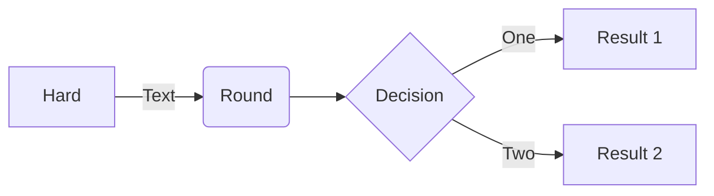
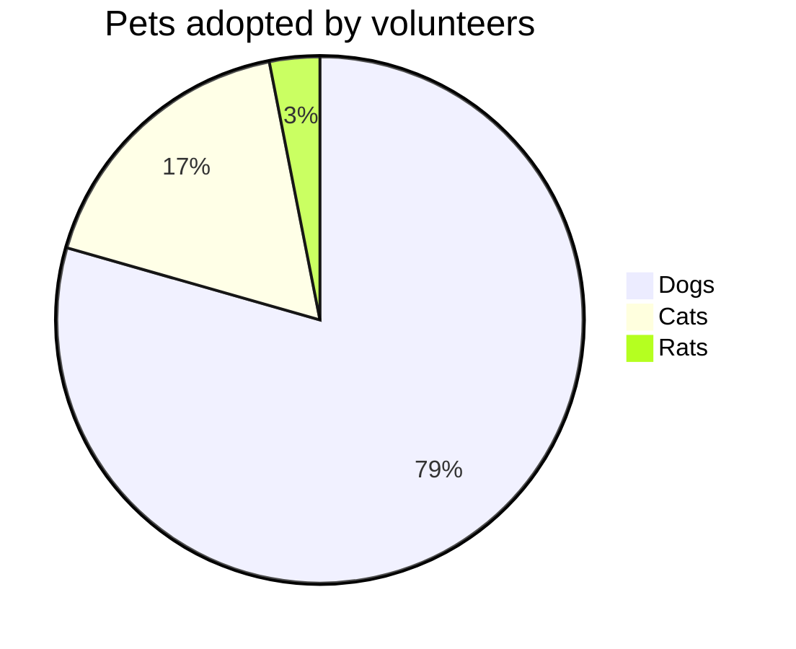

> Esto es un test. 
{: .prompt-tip }

> Esto es un test. 
{: .prompt-info }

> Esto es un test. 
{: .prompt-warning }

> Esto es un test. 
{: .prompt-danger }

`/path/to/a/file.extend`{: .filepath}

```shell
echo 'No more line numbers!'
```
{: .nolineno }


```liquid

  This product's title contains the word Pack.

```


# Jekyll Static Site Generator

Hola y bienvenido a este sitio, aqui estaremos manteniendo toda la documentación de mi HomeLab, los siguientes mensajes son solo una prueba para markup language.

## Mermaid Code Sample



### Test de Terminal


```bash
ls
```
> Esto es un test. 
{: .prompt-tip }

### Test de MarkDown

```markdown

_Image Caption_
```

### Prometheus & Grafana

Project structure:
[_testcompose.yaml_](compose.yaml) 
```bash
.
├── assets
│   ├── img
│   │   └── favicons
│   │       ├── android-chrome-192x192.png
│   │       ├── android-chrome-512x512.png
│   │       ├── apple-touch-icon.png
│   │       ├── favicon-16x16.png
│   │       ├── favicon-32x32.png
│   │       ├── favicon.ico
│   │       ├── mstile-150x150.png
│   │       └── safari-pinned-tab.svg
│   └── lib
├── _config.yml
├── _data
│   ├── assets
│   │   ├── cross_origin.yml
│   │   └── self_host.yml
│   ├── contact.yml
│   ├── locales (Soporte para Lenguajes)
│   │   ├── bg-BG.yml
│   │   ├── de-DE.yml
│   │   ├── en.yml
│   │   ├── es-ES.yml
│   │   ├── fr-FR.yml
│   │   ├── hu-HU.yml
│   │   ├── id-ID.yml
│   │   ├── ko-KR.yml
│   │   ├── my-MM.yml
│   │   ├── pt-BR.yml
│   │   ├── ru-RU.yml
│   │   ├── tr-TR.yml
│   │   ├── uk-UA.yml
│   │   ├── vi-VN.yml
│   │   └── zh-CN.yml
│   └── share.yml
├── docker-compose.yml
├── Gemfile
├── Gemfile.lock
├── index.html
├── LICENSE
├── _plugins
│   └── posts-lastmod-hook.rb
├── _posts
│   ├── 2022-10-05-hello-homelab.md
│   ├── 2022-10-20-Portainer.md
│   └── 2022-10-31-Jekyll.md
├── README.md
├── _site (Auto Generado)
└── _tabs (Para las Categorias en el Blog)
    ├── about.md
    ├── archives.md
    ├── categories.md
    └── tags.md

```

[_compose.yaml_](compose.yaml)
```
services:
  prometheus:
    image: prom/prometheus
    ...
    ports:
      - 9090:9090
  grafana:
    image: grafana/grafana
    ...
    ports:
      - 3000:3000
```
The compose file defines a stack with two services `prometheus` and `grafana`.
When deploying the stack, docker compose maps port the default ports for each service to the equivalent ports on the host in order to inspect easier the web interface of each service.
Make sure the ports 9090 and 3000 on the host are not already in use.

## Deploy with docker compose

```
$ docker compose up -d
Creating network "prometheus-grafana_default" with the default driver
Creating volume "prometheus-grafana_prom_data" with default driver
...
Creating grafana    ... done
Creating prometheus ... done
Attaching to prometheus, grafana

```

## Expected result

Listing containers must show two containers running and the port mapping as below:
```
$ docker ps
CONTAINER ID        IMAGE               COMMAND                  CREATED             STATUS              PORTS                    NAMES
dbdec637814f        prom/prometheus     "/bin/prometheus --c…"   8 minutes ago       Up 8 minutes        0.0.0.0:9090->9090/tcp   prometheus
79f667cb7dc2        grafana/grafana     "/run.sh"                8 minutes ago       Up 8 minutes        0.0.0.0:3000->3000/tcp   grafana
```

Navigate to `http://localhost:3000` in your web browser and use the login credentials specified in the compose file to access Grafana. It is already configured with prometheus as the default datasource.


Navigate to `http://localhost:9090` in your web browser to access directly the web interface of prometheus.

Stop and remove the containers. Use `-v` to remove the volumes if looking to erase all data.
```
$ docker compose down -v
```